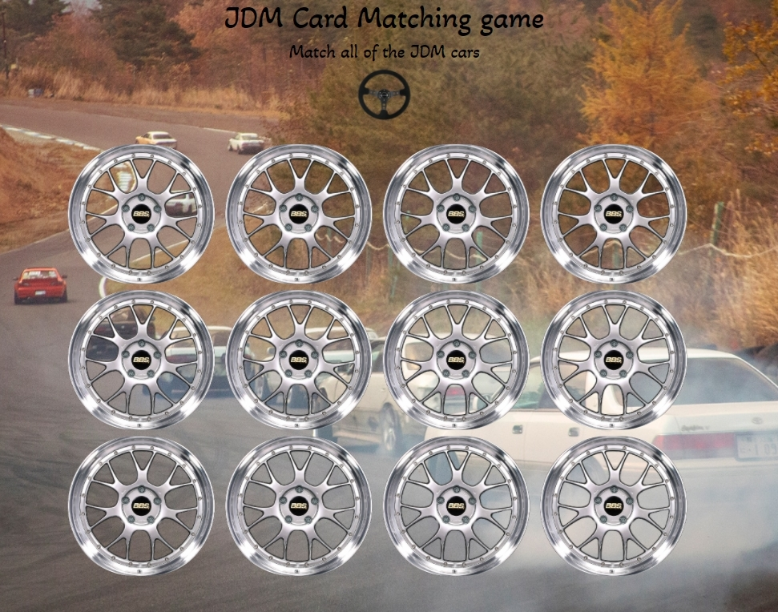

# jdmPersonalExpress
This Card-Matching game uses 6 possibilities of 6 JDM cars. To initiate the game the user needs to press the NRG steering wheel icon and user will be prompted with the game. The backside is a BBS Rim and when the user hovers over the rim the wheel will start spinning to create a small effect of the wheel moving. This application will allow the user to pick 2 cars at a time and will be prompted if they are a match or not. If the cars are a match then the user will be propted the name of the car and the cars will stay fillped over to ease the proccess of finding the rest. Each press to the steering wheel will reset the game if the user wishes so. I am using express in order to deploy my project on the server side.
 
&emsp;

## How Its Made 
**Languages used:** Html, CSS, Javascript, Node.js , Express
# What I Learned
I learned how to deploy one of my projects in the backend using Express in Node.js
### My Other Projects 
Check out some of my other work using the DOM!
* [Game of Thrones API](https://github.com/BrianMelaraDev/game-of-thrones-api)
* [My Demo Day!](https://github.com/BrianMelaraDev/demoday)
